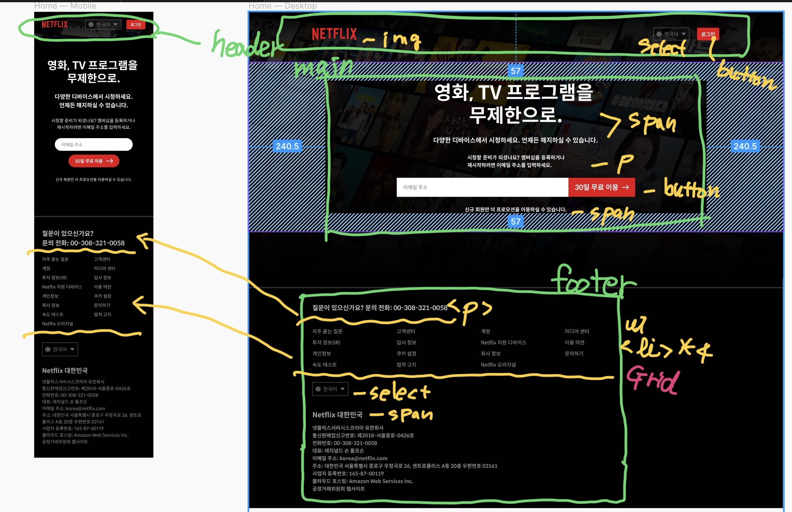
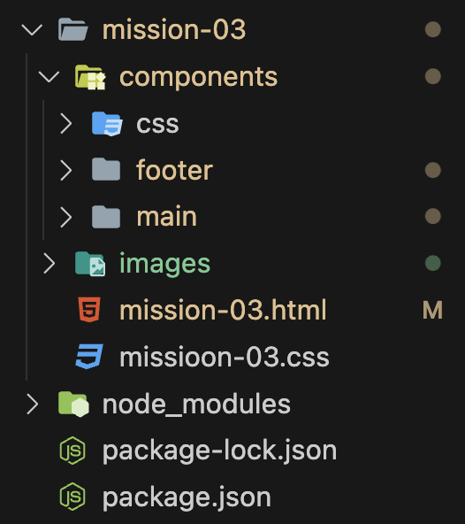
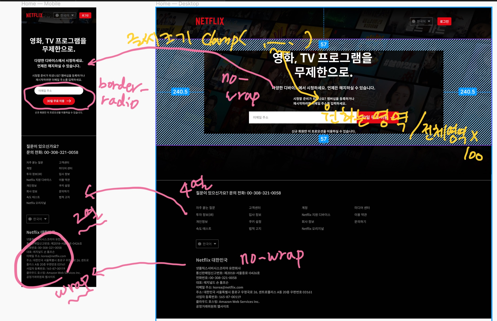
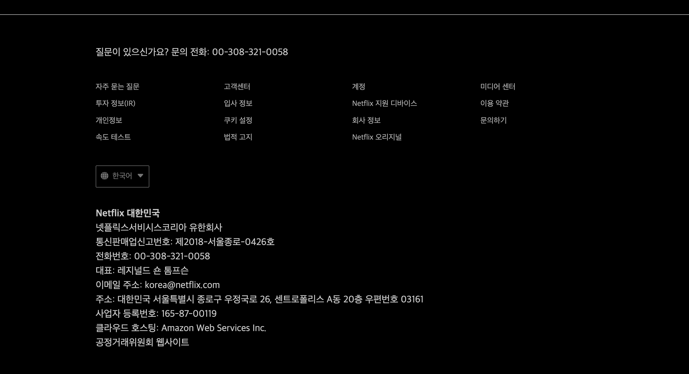
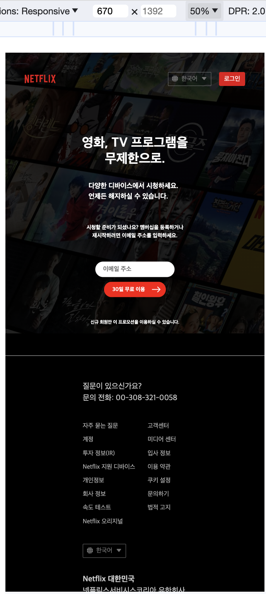
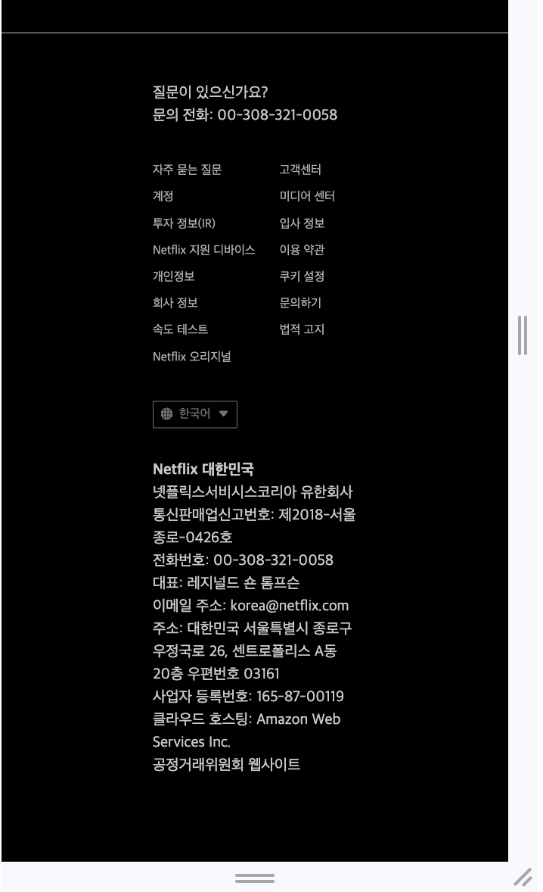

## 목차 
1. 마크업 구상
2. 컴포넌트 폴더와 파일 나누기
3. 반응형 구상
4. 768px 기준 동작캡쳐 
5. 아쉬웠던 점
6. 추가로 보완할 점


## 1. 마크업 구상


어떤 태그를 사용하면 좋을지, 컴포넌트 단위는 얼마나 쪼개면 좋을지 대략적으로 구분해 보았다.

## 2.컴포넌트 폴더와 파일 나누기



컴포넌트는 크게 3가지로 나누었는데, 

-헤더
-메인
-푸터 

이다. 

모든 컴포넌트를 합치는 곳을 
mission-03.html로 정했고, 헤더 부분도 여기에서 작업하기로 했다.

### 3. 반응형 구상


뷰포트 768px 기준으로 나뉠 때, 어떤 방식으로 바뀌어야 하는지 직접 그림을 그려서 고려했다. 


### 4. 768px 기준 동작캡쳐

- 768px 이상





- 768px 이하




### 5. 아쉬웠던 점

- select 태그를 커스텀하는 방법을 도저히 찾을 수가 없어서 background-image를 2개 주고 배치하는 방식을 선택했지만 다른 방법은 어떠한 것이 있는지 궁금하다.

```
  select{
    appearance: none;
    background: transparent;
    border: 0 solid transparent;
    color: #757575;
    border-radius: 2px;
    border: 1px solid var(--gray-500, #757575);
    padding: 10px 34px;
    background: url('/images/global.svg'), url('/images/down-fill.svg');
    background-position: 10% 45%, 90% 45%;
    background-repeat: no-repeat;
    margin-right: 24px;
      }
```

- 마지막 푸터에서 address태그 안에서 wrap이 동작하는 부분을 컨테이너 쿼리로 해보고 싶었는데 마음대로 되지 않아서 속상했다. 그치만 포기하지 않고 미디어쿼리를 추가해서 구현해보았다.

  ```

@media (max-width: 1090px){

  .address em{ 
    display: inline-block;
    white-space: wrap;

  }
}
  ```

- 피그마에서 보는 것과 추출하는 값이 눈으로 보는 것과 차이가 있어서, 눈으로 보는 기준을 우선시 했지만 정밀한 값을 하나하나 고려하는 것이 너무 힘들었다. 

### 6. 추가로 보완할 점 

- rem, em과 같은 상대단위에 조금 더 익숙해져야겠다. 

- 반응형에 맞추어서 값을 설정하는 것에 더 많은 고민이 필요하다.

- 기본 태그의 기능에 대한 이해를 높여야겠다. (시멘틱 마크업에 대한 고민이 더 필요하다.) 
